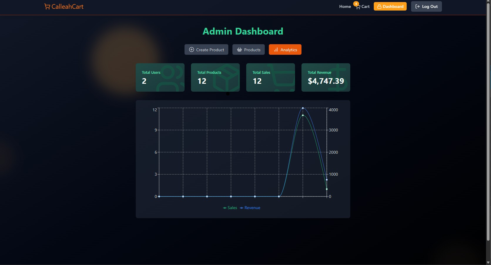

# 🛒 CalleahCart

**CalleahCart** is a full-stack e-commerce web application built with modern technologies, enabling users to browse products, manage their cart, and securely complete purchases online.

---

## 💻 Tech Stack

**Frontend:**

- Vite + React
- TailwindCSS
- Axios
- Zustand (or your preferred state management, if any)

**Backend:**

- Node.js + Express
- MongoDB + Mongoose
- Stripe API for payments
- Cloudinary for image storage
- JWT for authentication
- Redis (via ioredis) for caching and refreshToken Storage

**Dev Tools:**

- Nodemon
- Mailtrap (for testing emails)
- cloudinary
- Dotenv for config

---

## ⚙️ Features

- 🔐 Authentication (Sign Up / Login / Logout)
- ✅ Email verification / Successful Payment / Welcome Email
- 🔁 Forgot & Reset Password
- 🛍️ Product Browsing & Filtering (by Category, Featured)
- 🛒 Cart Management (Add, Update, Remove)
- 💸 Secure Stripe Checkout Integration
- 📦 Order Tracking
- 🎟️ Coupon System
- 📊 Admin Dashboard & Analytics
- ☁️ Cloudinary Image Upload Support

---

## 🖼️ Screenshots

### 🏠 Login Page


## Sign Up Page


### 🛒 Forgot Password Page


### 🏠 Home Page


### 🛒 Analytics Page



### 🛒 Create Product Page


### 🛒 Admin Product Page


### Checkout Page


### Email


---

## 🚀 Getting Started

### 1. Clone the repo

```bash
git clone https://github.com/your-username/calleahcart.git
cd calleahcart
```

### 2. Set up environment variables

Create a `.env` file in the root and backend directories with the necessary environment variables:

```env
PORT=5000
MONGO_URI=your_mongodb_connection_string
JWT_SECRET=your_jwt_secret
CLOUDINARY_CLOUD_NAME=your_cloudinary_name
CLOUDINARY_API_KEY=your_key
CLOUDINARY_API_SECRET=your_secret
STRIPE_SECRET_KEY=your_stripe_key
REDIS_URL=your_redis_connection_url
```

### 3. Install dependencies

```bash
npm install
npm install --prefix client
```

### 4. Run in development

```bash
npm run dev
```

Backend will run on: `http://localhost:5000`  
Frontend (Vite) will run on: `http://localhost:5173`

---

## 🛠️ Build for Production

```bash
npm run build
```

This will build the frontend inside the `/client` folder. Then, on deploy (e.g. Render or Vercel), your app will run `npm start`, which serves the client from Express.

---

## 🌐 Deployment

CalleahCart is designed for easy deployment to platforms like **Render**, **Vercel**, or **Heroku**.

### Start Command (Render)

```bash
npm start
```

Make sure your build command is:

```bash
npm run build
```

---

## 👨‍💻 Author

Made with 💙 by [Allen Custodio](https://www.linkedin.com/in/allenchristiancustodio)

---

## 📄 License

This project is licensed under the ISC License.

---

## 💫 Contributions

Contributions are welcome! Feel free to fork the repo, open issues, or create PRs.
